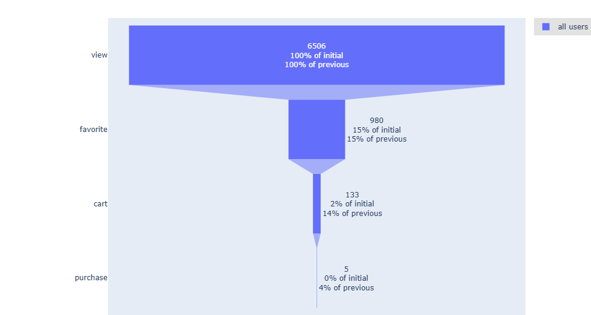
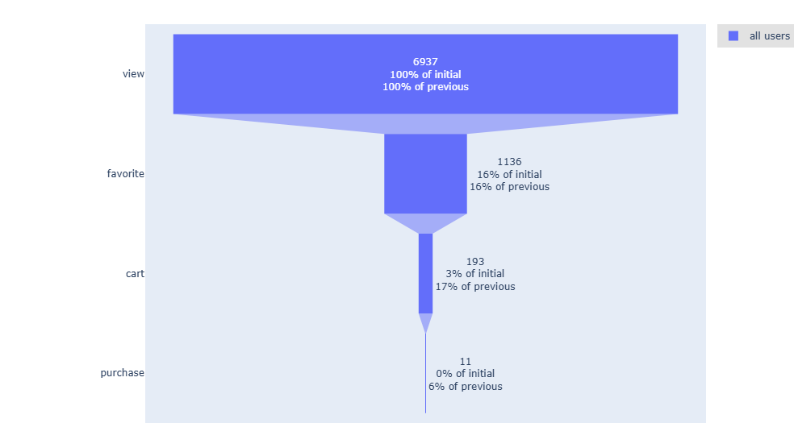
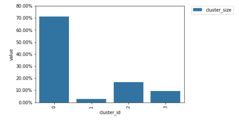
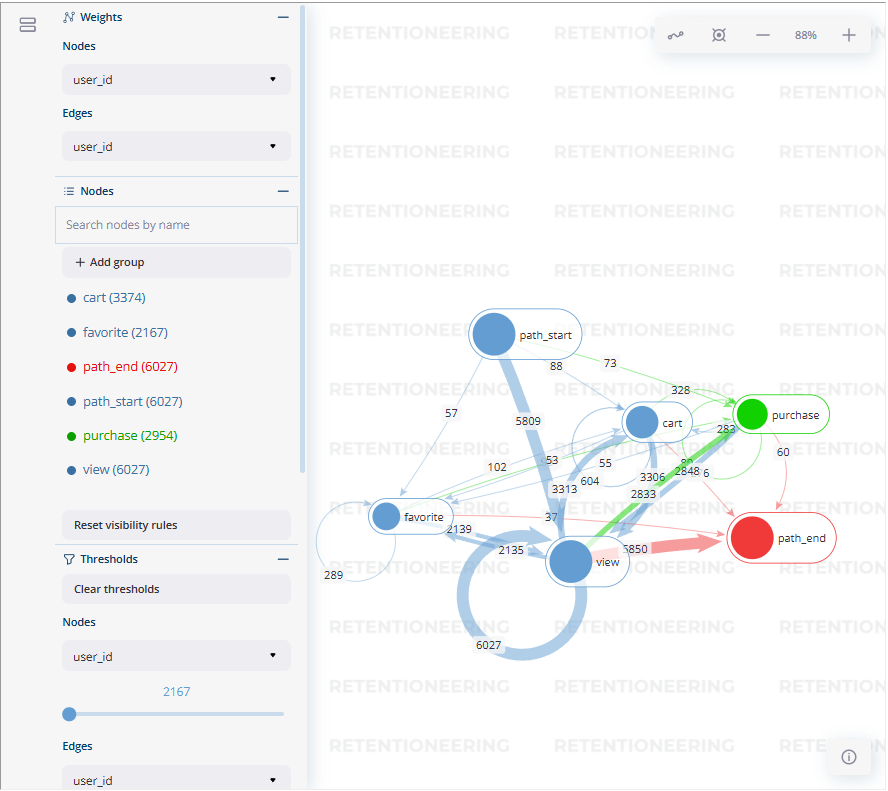
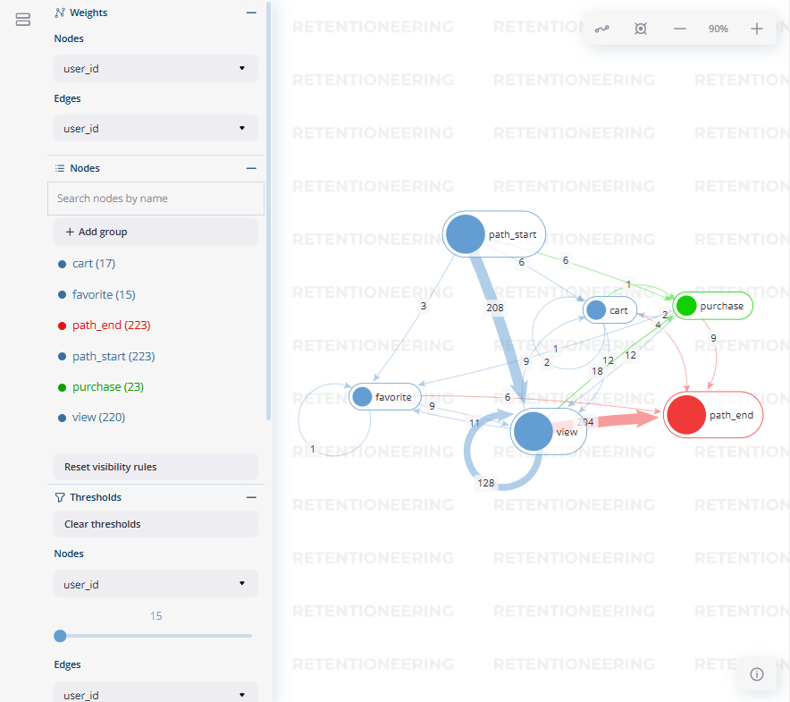
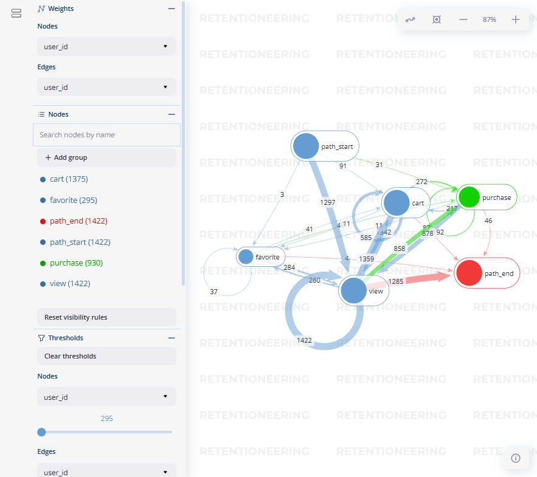
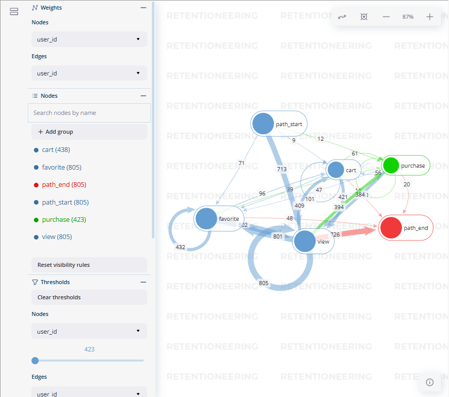

# 电商双12业务数据分析实战项目 · D12 Commerce Analytics

> 真实业务问题驱动的端到端数据分析流程（数据提取清洗/EDA/用户分群/用户画像/购买行为序列/留存分析）。  
> An end-to-end, business-driven analytics workflow (ETL/Cleaning, EDA, Segmentation, Personas, Purchase Sequences, Retention).

---

## 目录 · Table of Contents
- [项目简介 · Overview](#项目简介--overview)
- [数据集 · Dataset](#数据集--dataset)
- [运行指南 · How to Run](#运行指南--how-to-run)
- [分析模块 · Analysis Modules](#分析模块--analysis-modules)

---

## 项目简介 · Overview
**中文**：本项目以真实业务为导向，完整演示数据分析师的日常流程：数据提取与清洗、探索性数据分析、用户分群与画像、购买行为序列与留存分析。提供可复现的 `main_en.ipynb` 与公开数据集（下载后重命名为 `ali-cloud-dataset.csv` 并与 Notebook 同路径），适合系统入门与实战参考。  
**EN**: This project showcases a production-style analytics pipeline: extraction/cleaning, EDA, user segmentation, personas, purchase-sequence and retention analysis. It is fully reproducible via `main_en.ipynb` with a public dataset (rename to `ali-cloud-dataset.csv` and place next to the notebook).

---

## 数据集 · Dataset
**中文**  
1. 下载解压ali-cloud-dataset数据集。  
2. 重命名为：`ali-cloud-dataset.csv`。  
3. 将其与 `main_en.ipynb` 放在**同一路径**（或按你在 Notebook 中的路径设置）。
4. 您也可以直接访问数据集官网：https://tianchi.aliyun.com/dataset/196209?flow_extra=eyJpbmxpbmVfZGlzcGxheV9wb3NpdGlvbiI6MCwiZG9jX3Bvc2l0aW9uIjoxLCJkb2NfaWQiOiI5OTVjN2JkNDBlMzk3MTMxLTZmMmEyZTU3MmUzMDk0ZTMifQ%3D%3D&webview_progress_bar=1&show_loading=0&f_link_type=f_linkinlinenote&push_animated=1&theme=light

**EN**  
1. Download the public dataset.  
2. Rename it to `ali-cloud-dataset.csv`.  
3. Place it **alongside** `main_en.ipynb` (or update the path in the notebook).
4. You can also visit the dataset's official website：https://tianchi.aliyun.com/dataset/196209?flow_extra=eyJpbmxpbmVfZGlzcGxheV9wb3NpdGlvbiI6MCwiZG9jX3Bvc2l0aW9uIjoxLCJkb2NfaWQiOiI5OTVjN2JkNDBlMzk3MTMxLTZmMmEyZTU3MmUzMDk0ZTMifQ%3D%3D&webview_progress_bar=1&show_loading=0&f_link_type=f_linkinlinenote&push_animated=1&theme=light

---
## 数据集 · How to Run
中文：打开 main_en.ipynb，按顺序依次运行每个代码块，按照注释完成参数或路径设置，即可复现分析结果与可视化。
如果您是第一次运行此项目，**必须**先从数据集 URL 下载数据集，或直接下载解压ali-cloud-dataset压缩包里的数据集。
下载/解压完成后，将数据集文件重命名为 **ali-cloud-dataset.csv**，并将其放置在与代码文件 **main_en.ipynb** 相同的目录下。

EN: If this is your first time running the project, you **must** first download the dataset from the dataset URL. 
After downloading, rename the dataset file to **ali-cloud-dataset.csv**, and place it in the **same directory** as the code file **main_en.ipynb**. 
Open main_en.ipynb and run all cells in order. Follow the in-notebook comments to set parameters/paths and reproduce the analysis and visuals.

---
## 分析模块 · Analysis Modules
### 业务问题1：在活动当日，增量来自哪里？
#### 方法
1. **标准化事件序列**：`浏览 → 收藏 → 加购 → 成交`，并构建：
   - **步骤矩阵**
   - **桑基图**
2. 采用“**首次到达 → 后续发生**”的定义计算**用户层转化率**，以避免重复计数。
3. **基线**：使用**对称窗口**。
   - 以活动**前 3 天（12-08 ~ 12-10）**与活动**后 3 天（12-14 ~ 12-16）**的平均值作为基线。
   - **好处**：消除单侧偏差（活动前“逛”与活动后“溢出效应”）。

#### 交付物
1. **活动前/活动中/活动后**的**桑基总体漏斗** **+** **步骤层**转化。
2. **活动前/活动中/活动后**的**转化率漏斗** **+** **步骤层**转化。

### Business Question：On the event day, where did the uplift come from?  
#### Method
1. **Standardize the event sequence**: `view → favorite → cart → purchase`, and build:
   - a **step matrix**
   - a **Sankey** diagram
2. **Compute user-level conversion rates** using a “first arrival → subsequent occurrence” definition to avoid double counting.
3. **Baseline**: Use a symmetric window.
   - Take the average of the **3 days before** the event (**12-08 ~ 12-10**) and the **3 days after** the event (**12-14 ~ 12-16**) as the baseline.
   - **Benefit**: Eliminates one-sided bias (pre-event window-shopping vs. post-event spillover).

#### Deliverables
1. **Pre-event, in-event, and post-event** **Sankey** overall funnel **+** step-level conversions.
2. **Pre-event, in-event, and post-event** **conversion-rate funnel** **+** step-level conversions.

#### 双12前3天sankey图
.png)
#### 双12后3天sankey图
.png)
#### 双12活动3天内sankey图
.png)
#### 双12前3天转换率漏斗图

#### 双12后3天转换率漏斗图

#### 双12活动3天内转换率漏斗图

### 业务问题2：针对双12活动，新获客用户在首日触点之后的复访/复购表现如何？活动是否带动了后续活跃？

#### （A）留存的价值
尽管大促当天的首要目标是销售，但在复盘阶段，运营与数据团队会关注：

- 活动期间新获客用户在**次月/下季度**是否持续复购、比例如何？
- 若留存很低，说明“补贴驱动的大促”仅带来短期拉升，**缺乏长期价值**。

#### 方法
- 以**“首日”为分群锚点（cohort anchor）**，按**日粒度**计算 **D1/D3/D7 留存**（小时汇总到日）。
- 分析**首购品类**与**后续活跃/复购行为**之间的关系。

#### 交付物
- **分群（Cohort）热力图**
- **活动前/后分群对比**

### Business Question2：For the Double 12 event, how did newly acquired users perform in terms of revisit/re-purchase activity after their first-day touchpoint? Did the event drive subsequent activity?

#### (A) The Value of Retention
Although the primary goal on the mega-sale day is to sell, during the retrospective, the operations and data teams will examine:

- Among the new users acquired during the event period, how many continue to re-purchase in the next month/next quarter?
- If retention is very low, it indicates that a “subsidy-driven mega promotion” only delivers a short-term lift and lacks long-term value.

#### Method
- Use the **“first day” as the cohort anchor**, and compute **D1/D3/D7 retention** at a **daily level** (aggregate hourly to daily).
- Analyze the **relationship between first purchase category and subsequent activity**.

#### Deliverables
- **Cohort heatmap**
- **Pre-/post-event cohort comparison**

#### 双12活动新用户1/3/7日转化率

#### 双12活动新用户和其他口径新用户1/3/7日转化率对比折线图

### 业务问题3：在购买当日，基于用户行为对用户画像进行聚类。

#### 方法
使用 **Retentioneering 的路径相似度聚类**，将用户购买行为分为以下模式：
- **快速购买**：短路径 `浏览 → 加购 → 成交`。
- **重复收藏**：`浏览 ↔ 收藏` 循环，几乎无加购。
- **加购但犹豫下单**：多次加购但未成交。
- **直接购买**：冲动型购买（前置步骤极少）。

#### 交付物
- **各聚类样本规模**
- **各聚类转化率**
- **停留步数 / 路径步长**（每个聚类）

### Business Question3：Cluster user personas based on behaviors on the purchase day.

#### Method
Use **Retentioneering’s path-similarity clustering** to group users’ purchasing behaviors into the following patterns:
- **Fast purchase**: short path `view → cart → purchase`.
- **Repetitive bookmarking**: loops of `view ↔ favorite`, little cart activity.
- **Add-to-cart but hesitant to buy**: multiple cart events without purchase.
- **Direct purchase**: impulsive buyers (minimal preceding steps).

#### Deliverables
- **Cluster sizes**
- **Conversion rates** per cluster
- **Dwell steps / path length** for each cluster

#### 双12活动用户分群聚类画像

#### 双12活动用户分群聚类画像细节

#### 聚类0 pattern

#### 聚类1 pattern

#### 聚类2 pattern

#### 聚类3 pattern

### 业务问题4：购买行为序列分析
### Business Question4：Purchase behavior sequence analysis

